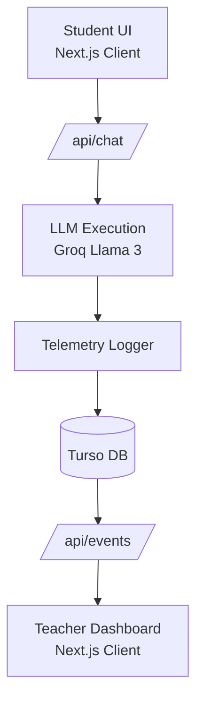
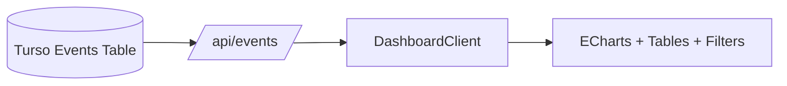
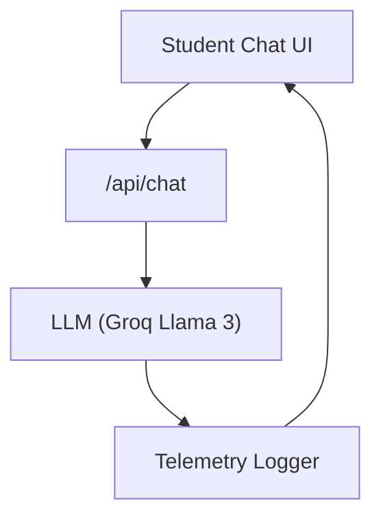

# **PromptShield Live**  
A real‑time classroom‑scale AI monitoring platform with a teacher dashboard, student chat interface, and event‑sourced telemetry.

---

## **Table of Contents**

- [Overview](#overview)
- [Screenshots](#screenshots)
- [Core Capabilities](#core-capabilities)
- [Architecture](#architecture)
- [Teacher Dashboard](#teacher-dashboard)
- [Student Experience](#student-experience)
- [Data Model](#data-model)
- [Tech Stack](#tech-stack)
- [Installation & Setup](#installation--setup)
- [Project Structure](#project-structure)
- [Roadmap](#roadmap)

---

## 📌 **Overview**

<details>
<summary><strong>Principal‑level summary</strong></summary>

PromptShield Live is a **real‑time AI classroom monitoring system** that provides:

- A **student‑facing chat interface** powered by Llama 3  
- A **teacher‑facing dashboard** for monitoring prompts, responses, and session activity  
- **Event‑sourced telemetry** stored in Turso  
- **Real‑time updates** (polling today, SSE/WebSockets coming next)

The project demonstrates how to build a **safe, observable, classroom‑ready LLM application** with clean architecture and modern tooling.

</details>

---

## 🖼 **Screenshots**

<details>
<summary><strong>Click to expand</strong></summary>

### **Teacher Dashboard**
`[Looks like the result wasn't safe to show. Let's switch things up and try something else!]`

### **Student Chat**
`[Looks like the result wasn't safe to show. Let's switch things up and try something else!]`

### **Session Explorer**
`[Looks like the result wasn't safe to show. Let's switch things up and try something else!]`

> Add your actual screenshots to `public/screenshots/` and update filenames as needed.

</details>

---

## ✨ **Core Capabilities**

<details>
<summary><strong>Click to expand</strong></summary>

- Student chat interface with session tracking  
- Teacher dashboard with:
  - Event table  
  - Session explorer  
  - Risk indicators  
  - ECharts visualizations  
  - Filters (risk, category, session)  
- Auto‑refresh + manual refresh  
- Structured telemetry logging  
- Turso‑backed event storage  
- Groq‑powered Llama 3 inference  
- Clean, modular Next.js architecture  

> **Note:**  
> The original safety pipeline (injection detector, classifier, risk scorer, rewrite engine) was removed during the v2 refactor.  
> The system now focuses on **monitoring**, not enforcing.

</details>

---

## 🏗 **Architecture**

<details>
<summary><strong>System‑level architecture diagram</strong></summary>



### Architectural Principles

- Stateless API routes  
- Event‑sourced telemetry  
- Durable session tracking  
- Clear separation of concerns  
- Real‑time monitoring (polling → SSE soon)

</details>

---

## 📊 **Teacher Dashboard**

<details>
<summary><strong>Operational intelligence for educators</strong></summary>

The dashboard provides real‑time visibility into:

- Student prompts  
- LLM responses  
- Session activity  
- Latency metrics  
- Time‑series charts  
- Risk indicators  
- Filters for risk, category, and session  



The dashboard is built under:

```
app/teacher/dashboard/
```

and uses a clean, modular component structure.

</details>

---

## 💬 **Student Experience**

<details>
<summary><strong>Safe, guided LLM interaction</strong></summary>

The student UI provides:

- Clean chat interface  
- Session‑scoped conversation  
- Real‑time responses from Llama 3  
- Automatic event logging  



</details>

---

## 🗄 **Data Model**

<details>
<summary><strong>Event‑sourced telemetry model</strong></summary>

### `PromptShieldEvents`

| Column        | Type     | Description |
|---------------|----------|-------------|
| id            | text     | Event UUID |
| timestamp     | numeric  | Server timestamp |
| sessionId     | text     | Student session |
| input         | text     | User prompt |
| response      | text     | LLM output |
| modelName     | text     | LLM model used |
| latencyMs     | integer  | End‑to‑end latency |
| sourceIp      | text     | Client IP |
| userAgent     | text     | Browser UA |

> All safety‑related fields were removed during the v2 refactor.

</details>

---

## 🧰 **Tech Stack**

<details>
<summary><strong>Click to expand</strong></summary>

### **Frontend**
- Next.js 14 (App Router)
- React
- TailwindCSS
- ECharts

### **Backend**
- Next.js API Routes
- Groq Llama 3 inference

### **Database**
- Turso (libSQL)

### **Observability**
- Event‑sourced telemetry  
- Session‑based analytics  

</details>

---

## ⚙️ **Installation & Setup**

<details>
<summary><strong>Click to expand</strong></summary>

### **1. Clone the repo**

```bash
git clone https://github.com/yourname/promptshield-live.git
cd promptshield-live
```

### **2. Install dependencies**

```bash
npm install
```

### **3. Create `.env.local`**

```env
GROQ_API_KEY=your_key_here
TURSO_DATABASE_URL=your_url_here
TURSO_AUTH_TOKEN=your_token_here
```

### **4. Run database migrations (if applicable)**

```bash
npm run db:push
```

### **5. Start the dev server**

```bash
npm run dev
```

### **6. Open the app**

- Student UI → http://localhost:3000/student  
- Teacher Dashboard → http://localhost:3000/teacher  

</details>

---

## 📂 **Project Structure**

<details>
<summary><strong>Click to expand</strong></summary>

```
promptshield-live/
  app/
    api/chat/
    api/events/
    api/session/[id]/
    student/
    teacher/
      dashboard/
      lib/
      types/
  lib/
    db/
    llm/
  public/
    screenshots/
  package.json
  tsconfig.json
  next.config.ts
```

</details>

---

## 🗺 **Roadmap**

<details>
<summary><strong>Click to expand</strong></summary>

### ✔ **Completed**
- Student chat UI  
- Event logging + Turso integration  
- Teacher Dashboard v2  
- Charts + filters + sessions  
- Auto‑refresh + manual refresh  
- Mobile layout fixes  
- Removal of legacy safety pipeline  

### 🔜 **Next (Phase 8)**
- Real‑time streaming via SSE  
- “LIVE” indicator  
- “New events available” toast  
- Reduced polling  

### 🚀 **Future Enhancements**
- Forensic session explorer  
- Export tools  
- Classroom analytics  
- Policy enforcement (optional future direction)

</details>
