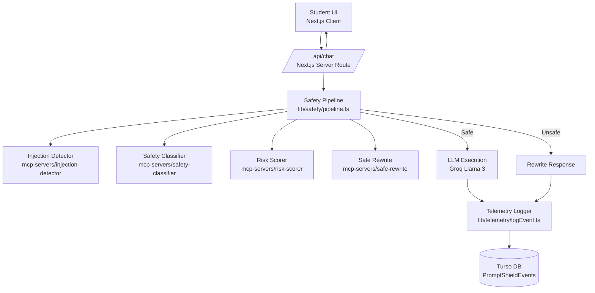
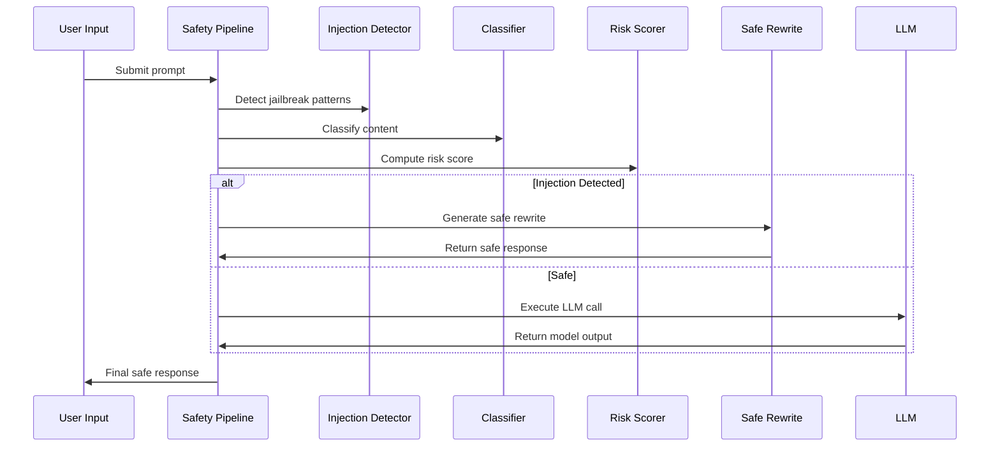
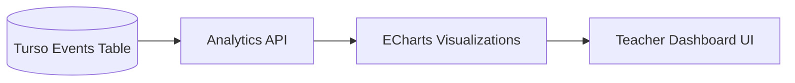
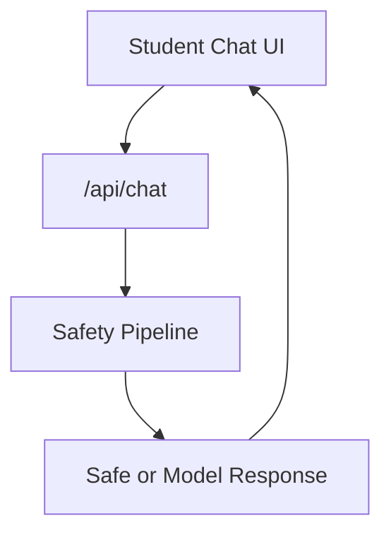
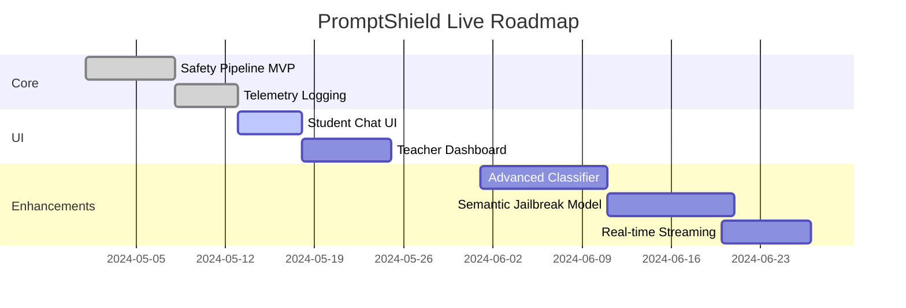

# **PromptShield Live**  
A real‑time AI safety, governance, and classroom‑scale monitoring platform designed with enterprise‑grade architectural rigor.

---

## **Table of Contents**

- [Overview](#-overview)
- [Core Capabilities](#-core-capabilities)
- [Architecture](#-architecture)
- [Safety Pipeline](#-safety-pipeline)
- [Teacher Dashboard](#-teacher-dashboard)
- [Student Experience](#-student-experience)
- [Data Model & Telemetry](#-data-model--telemetry)
- [Tech Stack](#-tech-stack)
- [Project Structure](#-project-structure)
- [Roadmap](#-roadmap)

---

## 📌 **Overview**

<details>
<summary><strong>Principal‑level summary</strong></summary>

PromptShield Live is a **modular AI safety and monitoring system** demonstrating how modern LLM applications can be governed, audited, and controlled in real time. It integrates:

- A **policy‑enforced safety pipeline**
- **MCP‑style modular safety services**
- **Real‑time telemetry ingestion**
- **Teacher‑facing operational dashboards**
- **Student‑facing safe LLM interface**

Architecturally, it models **enterprise AI governance patterns**:

- Deterministic safety gating before model execution  
- Event‑sourced telemetry for auditability  
- Stateless API surfaces backed by durable storage  
- Modular safety services for extensibility  
- Clear separation of concerns across UI, API, safety, and telemetry layers  

This project serves as a **reference implementation** for secure, observable, policy‑driven LLM deployments.

</details>

---

## ✨ **Core Capabilities**

<details>
<summary><strong>Click to expand</strong></summary>

- Prompt injection detection  
- Risk scoring and policy enforcement  
- Safe rewrite fallback path  
- Safety classification  
- Teacher dashboard with ECharts  
- Student chat interface with risk indicators  
- Structured telemetry logging to Turso  
- Groq‑powered Llama 3 inference  
- Modular MCP‑style safety services  
- Clean, extensible architecture  

</details>

---

## 🏗 **Architecture**

<details>
<summary><strong>System‑level architecture diagram</strong></summary>



### Architectural Principles

- Deterministic safety gating before model execution  
- Event‑sourced telemetry for auditability  
- Modular safety services for extensibility  
- Stateless API layer backed by durable storage  
- Clear separation of concerns across layers  

</details>

---

## 🛡 **Safety Pipeline**

<details>
<summary><strong>Pipeline flow and module responsibilities</strong></summary>



### Module Responsibilities

- **Injection Detector** — pattern‑based and semantic jailbreak detection  
- **Safety Classifier** — assigns content categories  
- **Risk Scorer** — converts classification + signals → risk level  
- **Safe Rewrite** — reformulates unsafe prompts into compliant variants  

</details>

---

## 📊 **Teacher Dashboard**

<details>
<summary><strong>Operational intelligence for educators</strong></summary>

The dashboard provides real‑time visibility into:

- Injection attempts  
- Risk distribution  
- Latency and model performance  
- Student activity timelines  
- Per‑session analytics  



This surface mirrors **enterprise observability** patterns:  
time‑series analysis, anomaly detection, and risk heatmaps.

</details>

---

## 💬 **Student Experience**

<details>
<summary><strong>Safe, guided LLM interaction</strong></summary>

The student UI provides:

- Clean chat interface  
- Real‑time safe responses  
- Risk indicators  
- Session‑scoped telemetry  
- Automatic safe rewrites when needed  



This ensures students receive **safe, policy‑aligned** responses without degrading usability.

</details>

---

## 🗄 **Data Model & Telemetry**

<details>
<summary><strong>Event‑sourced telemetry model</strong></summary>

### `PromptShieldEvents`

| Column             | Type     | Description |
|--------------------|----------|-------------|
| id                 | text     | Event UUID |
| timestamp          | numeric  | Server timestamp |
| sessionId          | text     | Student session |
| input              | text     | Raw user input |
| rawResponse        | text     | LLM output (unsafe path) |
| safeResponse       | text     | Final delivered output |
| classification     | text     | Safety classifier output |
| riskLevel          | text     | low / medium / high |
| injectionDetected  | numeric  | Boolean |
| rewriteApplied     | numeric  | Boolean |
| evalToxicity       | real     | Placeholder for future scoring |
| modelName          | text     | LLM model used |
| latencyMs          | integer  | End‑to‑end latency |
| sourceIp           | text     | Client IP |
| userAgent          | text     | Browser UA |

This schema supports:

- Auditability  
- Trend analysis  
- Risk monitoring  
- Session reconstruction  
- Future ML‑based anomaly detection  

</details>

---

## 🧰 **Tech Stack**

<details>
<summary><strong>Click to expand</strong></summary>

### **Frontend**
- Next.js 14 (App Router)
- React
- TailwindCSS
- ECharts

### **Backend**
- Next.js API Routes
- Modular MCP‑style safety services
- Groq Llama 3 inference

### **Database**
- Turso (libSQL)

### **Observability**
- Structured event logging  
- Session‑scoped analytics  

</details>

---

## 📂 **Project Structure**

<details>
<summary><strong>Click to expand</strong></summary>

```
promptshield-live/
  app/
    api/chat/route.ts
    student/page.tsx
    teacher/page.tsx
  lib/
    db/turso.ts
    llm/callLLM.ts
    safety/pipeline.ts
    telemetry/logEvent.ts
  mcp-servers/
    injection-detector/
    risk-scorer/
    safe-rewrite/
    safety-classifier/
  public/
  test-db.js
  package.json
  tsconfig.json
  next.config.ts
```

This structure enforces **clear boundaries** between UI, API, safety, and telemetry layers.

</details>

---

## 🗺 **Roadmap**

<details>
<summary><strong>Click to expand</strong></summary>



### Future Enhancements

- Semantic jailbreak detection  
- Multi‑dimensional risk scoring  
- Real‑time streaming responses  
- Policy‑driven enforcement engine  
- Plugin architecture for new safety modules  

</details>
