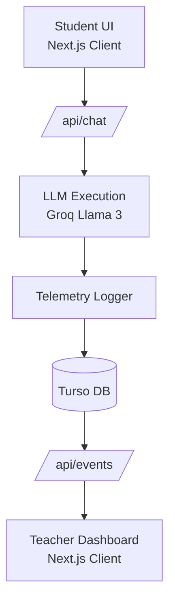
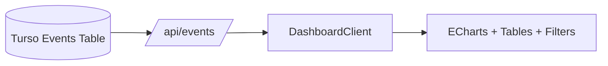
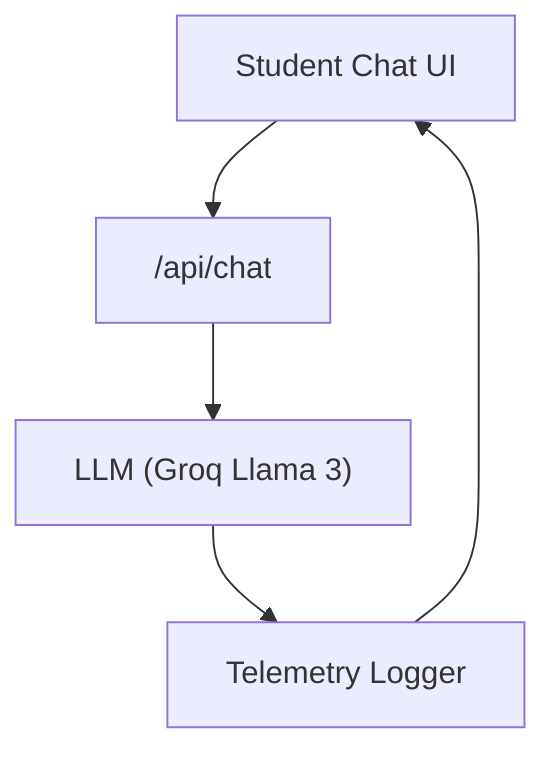

# <span style="font-size: 1.4em">📘 PromptShield Live</span>  
A real‑time classroom‑scale AI monitoring platform with a teacher dashboard, student chat interface, and event‑sourced telemetry.

---

## **Table of Contents**

- [Overview](#overview)
- [Screenshots](#screenshots)
- [Core Capabilities](#core-capabilities)
- [Architecture](#architecture)
- [Teacher Dashboard](#teacher-dashboard)
- [Student Experience](#student-experience)
- [Data Model](#data-model)
- [Tech Stack](#tech-stack)
- [Installation & Setup](#installation--setup)
- [Project Structure](#project-structure)
- [Roadmap](#roadmap)

---

# <span>📌</span> **Overview**

<details>
<summary><strong>Principal‑level summary</strong></summary>

PromptShield Live is a **real‑time AI classroom monitoring system** that provides:

- A **student‑facing chat interface** powered by Llama 3  
- A **teacher‑facing dashboard** for monitoring prompts, responses, and session activity  
- **Event‑sourced telemetry** stored in Turso  
- **Real‑time updates** (polling today, SSE/WebSockets coming next)

The project demonstrates how to build a **safe, observable, classroom‑ready LLM application** with clean architecture and modern tooling.

</details>

---

# <span>🖼</span> **Screenshots**

<details>
<summary><strong>Click to expand</strong></summary>

### **Teacher Dashboard**
`/public/screenshots/dashboard.png`

### **Student Chat**
`/public/screenshots/student-chat.png`

### **Session Explorer**
`/public/screenshots/session-explorer.png`

</details>

---

# <span>✨</span> **Core Capabilities**

<details>
<summary><strong>Click to expand</strong></summary>

- Student chat interface with session tracking  
- Teacher dashboard with:
  - Event table  
  - Session explorer  
  - Risk indicators  
  - ECharts visualizations  
  - Filters (risk, category, session)  
- Auto‑refresh + manual refresh  
- Structured telemetry logging  
- Turso‑backed event storage  
- Groq‑powered Llama 3 inference  
- Clean, modular Next.js architecture  

> **Note:**  
> The original safety pipeline (injection detector, classifier, risk scorer, rewrite engine) was removed during the v2 refactor.  
> The system now focuses on **monitoring**, not enforcing.

</details>

---

# <span>🏗</span> **Architecture**

<details>
<summary><strong>System‑level architecture diagram</strong></summary>



### Architectural Principles

- Stateless API routes  
- Event‑sourced telemetry  
- Durable session tracking  
- Clear separation of concerns  
- Real‑time monitoring (polling → SSE soon)

</details>

---

# <span>📊</span> **Teacher Dashboard**

<details>
<summary><strong>Operational intelligence for educators</strong></summary>

The dashboard provides real‑time visibility into:

- Student prompts  
- LLM responses  
- Session activity  
- Latency metrics  
- Time‑series charts  
- Risk indicators  
- Filters for risk, category, and session  



</details>

---

# <span>💬</span> **Student Experience**

<details>
<summary><strong>Safe, guided LLM interaction</strong></summary>



</details>

---

# <span>🗄</span> **Data Model**

<details>
<summary><strong>Event‑sourced telemetry model</strong></summary>

### `PromptShieldEvents`

| Column        | Type     | Description |
|---------------|----------|-------------|
| id            | text     | Event UUID |
| timestamp     | numeric  | Server timestamp |
| sessionId     | text     | Student session |
| input         | text     | User prompt |
| response      | text     | LLM output |
| modelName     | text     | LLM model used |
| latencyMs     | integer  | End‑to‑end latency |
| sourceIp      | text     | Client IP |
| userAgent     | text     | Browser UA |

</details>

---

# <span>🧰</span> **Tech Stack**

<details>
<summary><strong>Click to expand</strong></summary>

### **Frontend**
- Next.js 14 (App Router)
- React
- TailwindCSS
- ECharts

### **Backend**
- Next.js API Routes  
- Groq Llama 3 inference  

### **Database**
- Turso (libSQL)

### **Observability**
- Event‑sourced telemetry  
- Session‑based analytics  

</details>

---

# <span>⚙️</span> **Installation & Setup**

<details>
<summary><strong>Click to expand</strong></summary>

### 1. Clone the repo

```bash
git clone https://github.com/yourname/promptshield-live.git
cd promptshield-live
```

### 2. Install dependencies

```bash
npm install
```

### 3. Create `.env.local`

```env
GROQ_API_KEY=your_key_here
TURSO_DATABASE_URL=your_url_here
TURSO_AUTH_TOKEN=your_token_here
```

### 4. Start the dev server

```bash
npm run dev
```

### 5. Open the app

- Student UI → http://localhost:3000/student  
- Teacher Dashboard → http://localhost:3000/teacher  

</details>

---

# <span>📂</span> **Project Structure**

<details>
<summary><strong>Click to expand</strong></summary>

```
promptshield-live/
  app/
    api/chat/
    api/events/
    api/session/[id]/
    student/
    teacher/
      dashboard/
      lib/
      types/
  lib/
    db/
    llm/
  public/
    screenshots/
  package.json
  tsconfig.json
  next.config.ts
```

</details>

---

# <span>🗺</span> **Roadmap**

<details>
<summary><strong>Click to expand</strong></summary>

## **PHASE 1 — Project Foundation**
1. Initialize Next.js app  
2. Basic UI shell  

## **PHASE 2 — Event Model + Database**
3. Define EventRow + Session models  
4. Turso integration  

## **PHASE 3 — Student Chat Pipeline**
5. Build `/api/chat`  

## **PHASE 4 — Teacher Dashboard v1**
6. Basic dashboard  

## **PHASE 5 — Telemetry + Safety (Removed in v2)**
7. Safety pipeline (deprecated)  

## **PHASE 6 — Dashboard v2 Architecture**
8. New folder structure  
9. New charts  
10. Filters + sessions  

## **PHASE 7 — Real-Time Dashboard Behavior**
11. Auto‑refresh + manual refresh  
12. Mobile layout fixes  

## **PHASE 8 — Real-Time Streaming (Next)**
13. SSE/WebSockets  
14. LIVE indicator  
15. New events toast  

## **PHASE 9 — Forensic Session Explorer**
16. Deep dive modal  
17. Timeline navigation  

## **PHASE 10 — Teacher Tools + Governance**
18. Export tools  
19. Notes + flags  
20. Classroom analytics  

</details>
